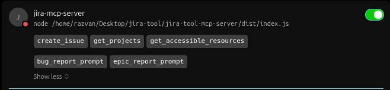
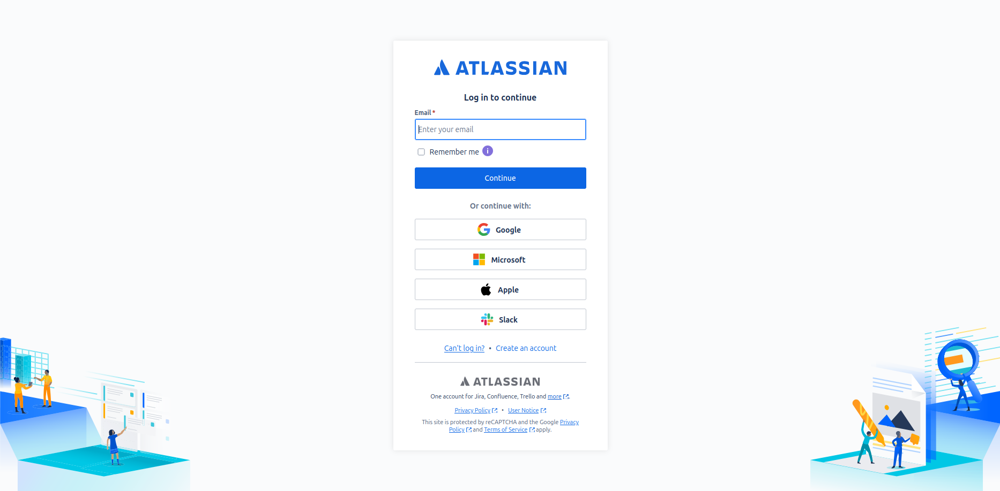
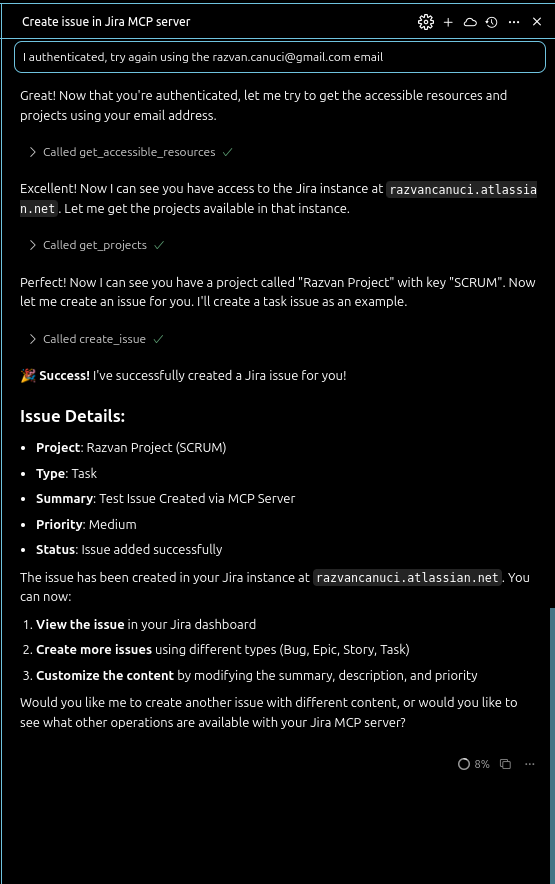
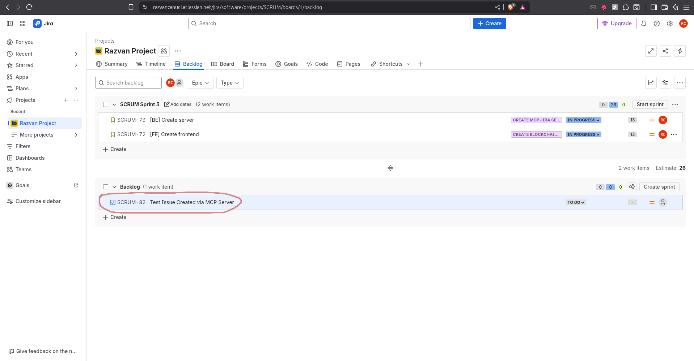
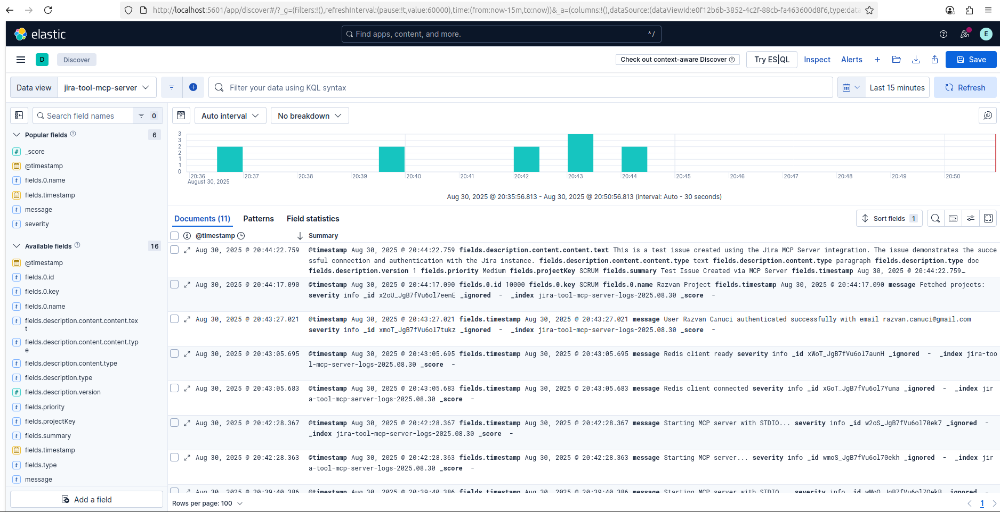

## JIRA ISSUE MCP SERVER

[](https://smithery.ai/server/@razvancanuci/jira-issue-mcp-server)

This is a sample MCP server implementation for Jira issues. It uses OAuth 2.0 (3LO) to authenticate with Jira and create issues.

## INSTRUCTIONS

1. Create an Atlassian developer account and set up an OAuth 2.0 (3LO) app to get a client ID and secret: https://developer.atlassian.com/apps/

2. Set up a Redis instance for caching the tokens and other data (should run on port 6379, redis default port).

3. Clone this repository and install dependencies with `npm install`.

4. Build the project with `npm run build`.

5. Configure the MCP server in your MCP client (e.g., Jira Service Management) with the JSON configuration. This is an example configuration for Cursor:

```json
{
  "mcpServers": {
    "jira-mcp-server": {
      "type": "stdio",
      "command": "node",
      "args": [
        "<path to the project>/dist/index.js"
      ],
      "env" :{
        "ATLASSIAN_CLIENT_ID": "<client id>",
        "ATLASSIAN_CLIENT_SECRET":"<client secret>",
        "ELASTIC_API_KEY": "<elastic api key>",
        "ELASTIC_URL": "<elastic url>",
        "REDIS_HOST": "<redis host>",
        "SERVER_DOMAIN": "<domain>"
      }
    }
  }
}
```

Environment variable descriptions

- ATLASSIAN_CLIENT_ID (required): the OAuth client ID from your Atlassian developer app. This and ATLASSIAN_CLIENT_SECRET are mandatory for the OAuth flow to work.
- ATLASSIAN_CLIENT_SECRET (required): the OAuth client secret from your Atlassian developer app.
- ELASTIC_API_KEY (optional): API key for Elastic (used for telemetry/logging if configured). Default: not set.
- ELASTIC_URL (optional): Elastic endpoint URL. Default: not set.
- REDIS_HOST (optional): Redis connection string or host:port used for caching tokens. Default: "localhost:6379".
- SERVER_DOMAIN (optional): Base URL where this server is reachable (used to build OAuth redirect/callback URLs). Default: "http://localhost:3000".

Only ATLASSIAN_CLIENT_ID and ATLASSIAN_CLIENT_SECRET are strictly required to run the server. All other environment variables are optional and can be left unset to use local/default behavior.

## DEMO
For the Demo I used Cursor as MCP client.
After the config added, you should see in settings something similar to this:



If there is no OAuth connection, first you will be redirected to the Atlassian authorization page to authorize the app.



After the authorization, you should go to the Cursor to tell him that now it's all done and Cursor will do the magic if you have only one resource accessible and only one project.



After that, you can see the task created in Jira.




If you have Elastic connected, you can see the logs in Kibana.


## LEGAL

- This project is not affiliated with Atlassian Inc.
- Respect Atlassian's API terms of service
- Your Jira instance credentials remain local
- No data is shared with third parties

## SECURITY

- OAuth tokens are stored locally
- Use environment variables for sensitive config
- Never commit credentials to version control